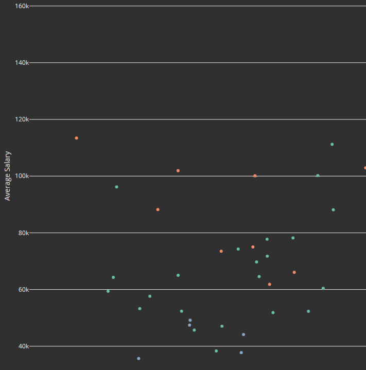

***
This project succeeded in answering the following:  

  
- **What are the most profitable jobs in Washington State? Where were they in other years?**
  
    - Surgeons were the most profitable in Washington for every year by a significant margin, earning on average more than twice as much as the next non-healthcare related career of computer and information research scientists for 2018.
  
  
   

  - The top occupations for Washington tend to be those which require extensive education and training. While the average salary for surgeons expose a large pay gap from the rest of the occupations, we cannot visualize the difference in stress, difficulty of work, and schedule that surgeons have from others. 
  
  ***

- **How have salaries and job saturation changed between 2014 and 2018 in Washington State?**

    - With over 2000 data points, the trends in the data cannot be described by any single movement. However, when focusing on actuaries in Washington, we can observe a large fluctuation in salary between 2014 and 2018. 

    

    - While at first glance, this might seem to suggest that the field experiences large fluctuations in average salary, it is imporant to note that Washington also does not have a large amount of actuaries compared to other fields. Considering this, it is more likely that the fluctuations are most likely due to more local changes to the actuarial field, rather than an indication of changes to the compensation in the field overall. 

  ***

- **Is there a wage gap between men and women working for the city of Seattle? Which careers have the largest gaps? Which pay the highest for each gender?**

  - When arranging the data to show the largest gaps, it is shown that while there are wage gaps, they are present for both men and women. When sorting by largest gaps with deficits for women, the gaps are slightly larger for some of the lower earning jobs, but nothing significant.

  
    
  - However, the most significant discovery emerging from this vizualization is that the data used simply does not have enough data points to construct a reasonable conclusion. While the averages of all the data can be compared with one another, we would lose valuable information in the form of what type of occupations we are comparing. 