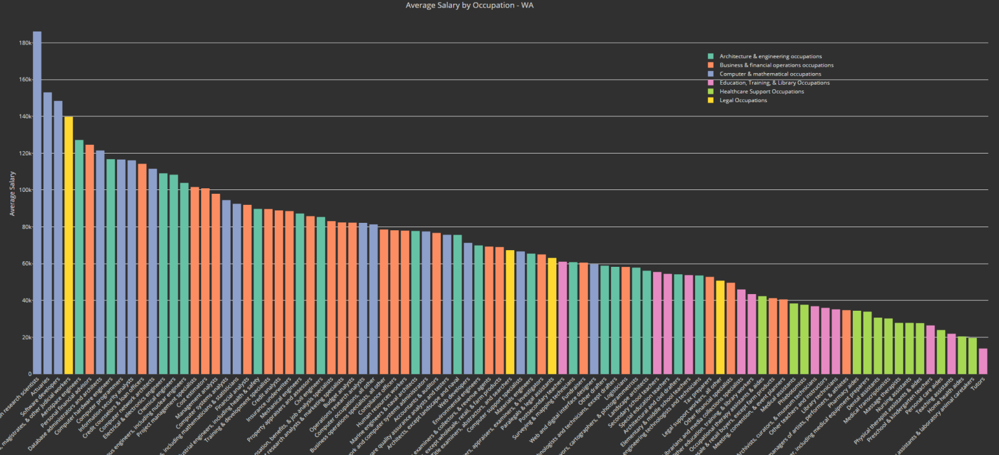
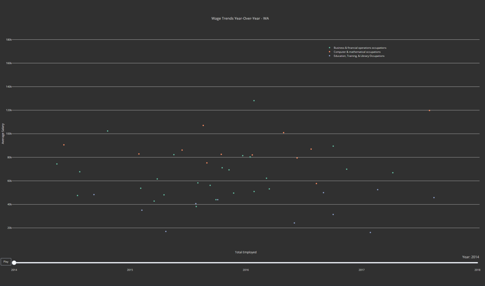
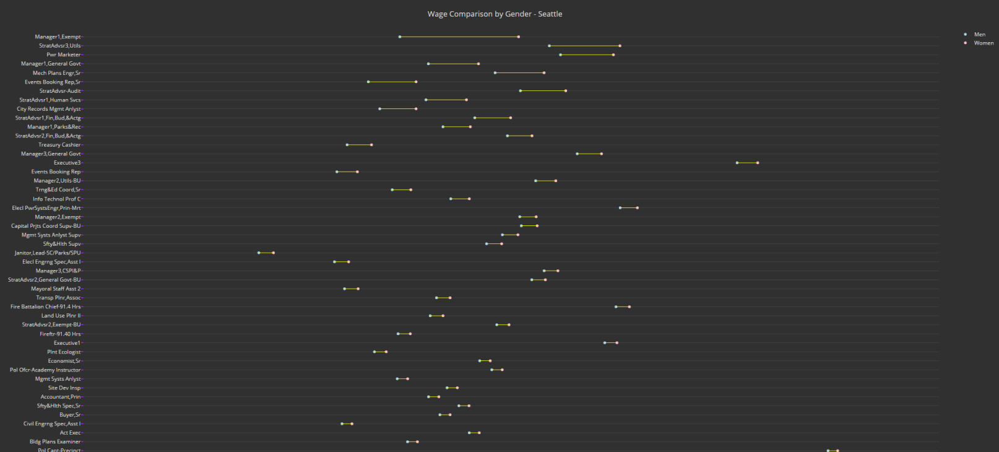

## Washington State Income Analysis
***

***
## Project Goals
This project aims to answer the following:

- **What are the most profitable jobs in Washington State? Where were they in other years?**

- **How have salaries and job saturation changed between 2014 and 2018 in Washington State?**

- **Is there a wage gap between men and women working for the city of Seattle? Which careers have the largest gaps? Which pay the highest for each gender?**

***
## What to Expect

#### **Page 1:** _Comparison by Occupation_

  
- This visualization displays occupations from up to 6 occupation groups and a specific year in order of average annual salary. 
- Hovering over the bars allows for viewing of exact average salary as well as number employed for this occupation in Washington State.
  
  ***
#### **Page 2:** _Comparison by Year_

  
- This visualization displays occupations by group plotted against average annual salary and total employed for the role in Washington State. 
- Annual change for salary and total employed can be experienced using the slider below the graph. 
- Hovering allows for viewing of occupation represented by the point as well as exact values for total employed and salary.

***
#### **Page 3:** _Comparison by Gender_

- This barbell plot displays occupations and wages for both men and women employed by the city of Seattle.
- Visualization can be sorted by highest average hourly pay for each gender, as well as occupations with the largest gaps between men and women.
- Number of shown observations can be controlled through a slider to allow for easier viewing. Plot length will also be affected.

***
### Data Sources
This project utilizes datasets collected by the [US Census](https://www.census.gov/en.html) and [Seattle public records](https://data.seattle.gov/).
Further details on data sources found in the "Finding Data" section of [README.md](https://github.com/marcrng/self/blob/master/README.md)
